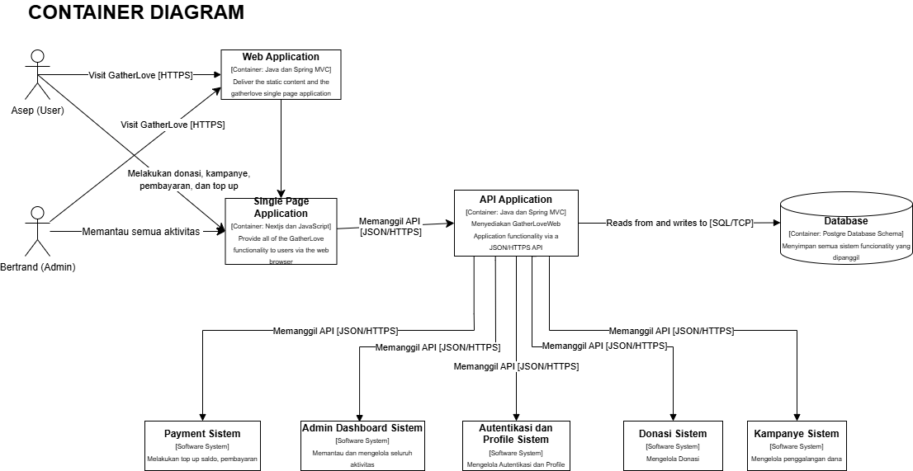
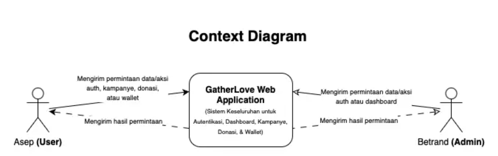
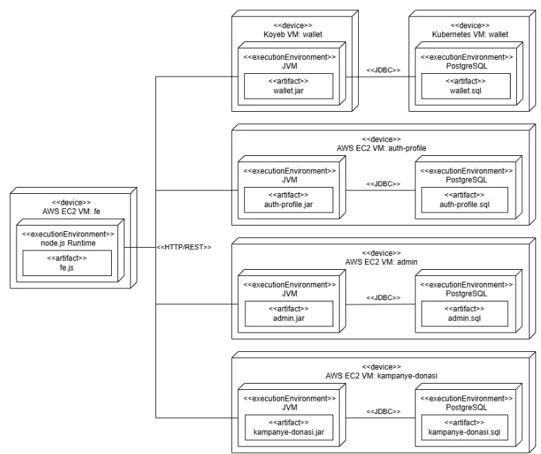
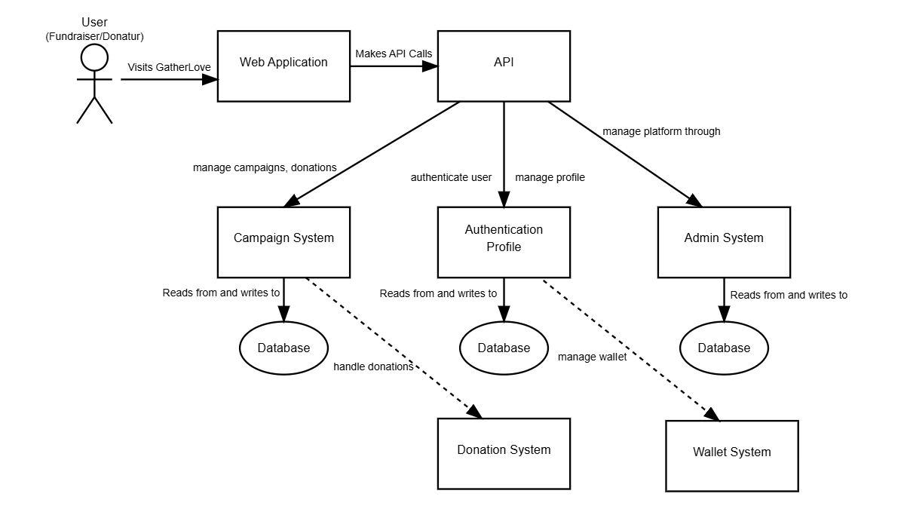
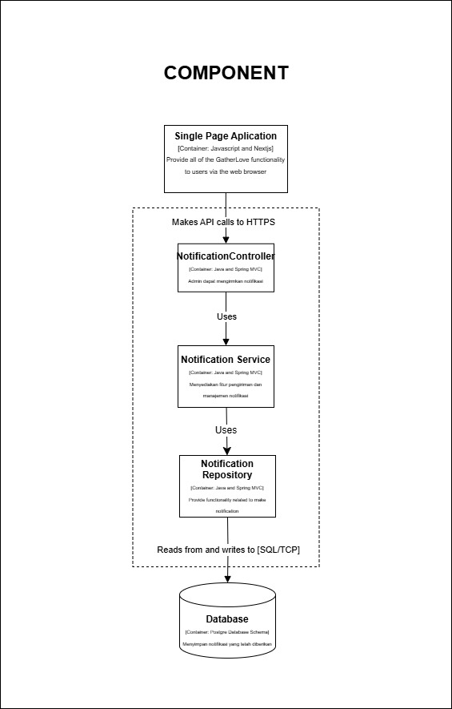
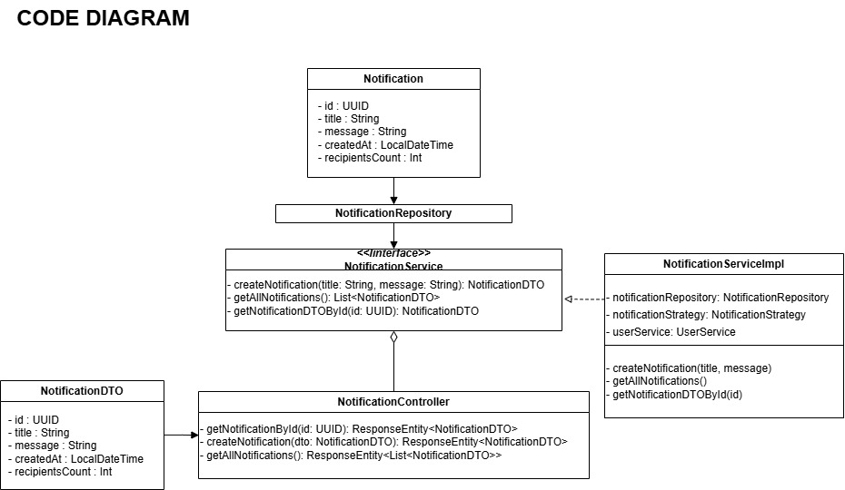

# advprog-module9
Module 9 Advanced Programming 2024/2025

## Deliverable G.1

### Container Diagram

### Context Diagram

### Deployment Diagram

## Deliverable G.2

## Deliverable G.3
Arsitektur perangkat lunak GatherLove yang digambarkan menggunakan pendekatan microservices dengan pemisahan layanan berdasarkan tanggung jawab, seperti sistem donasi, kampanye, autentikasi, dompet wallet, dan dashboard admin. Masing-masing layanan berjalan di lingkungan terisolasi (seperti AWS EC2 dan Koyeb VM), dengan *runtime* yang berbeda seperti Node.js untuk frontend dan JVM untuk backend, serta menggunakan database PostgreSQL yang terpisah untuk menjaga isolasi data. Pemisahan ini menunjukkan prinsip separation of concerns yang kuat, memungkinkan pengembangan, deployment, dan penskalaan layanan secara independen. Pendekatan ini juga sejalan dengan kebutuhan platform donasi dan kampanye yang dinamis dan berpotensi mengalami lonjakan trafik.

Dari sisi risiko, pendekatan microservices memiliki kompleksitas tinggi dalam pengelolaan data antar layanan. Karena setiap layanan memiliki database-nya sendiri, maka konsistensi data lintas sistem menjadi tantangan utama—khususnya saat menangani transaksi donasi, top-up saldo, atau update profil pengguna yang bersifat lintas-layanan. Selain itu, tanpa adanya API Gateway sebagai titik koordinasi, beban logika komunikasi dan keamanan akan tersebar di tiap layanan, sehingga menyulitkan penerapan kebijakan terpusat seperti otorisasi, monitoring, dan rate limiting. Sistem juga rentan terhadap kegagalan parsial jika tidak dilengkapi dengan mekanisme retry, fallback, atau circuit breaker.

Sebagai justifikasi, arsitektur ini tepat untuk platform berskala menengah hingga besar karena mendukung pertumbuhan modular. Untuk mengurangi risiko yang telah disebutkan, perlu dirancang strategi seperti implementasi event-driven architecture menggunakan message broker (misalnya Kafka atau RabbitMQ), penggunaan API Gateway untuk mengelola traffic dan keamanan, serta penerapan observability stack (seperti Prometheus dan Grafana) untuk monitoring dan alerting. Di sisi database, strategi replikasi dan sharding dapat dipersiapkan untuk mendukung pertumbuhan data jangka panjang. Dengan perbaikan tersebut, arsitektur ini akan mampu mendukung ekspansi sistem secara efisien dan tangguh.

## Deliverable Individual

### Fitur Kampanye

#### Component Diagram

#### Code Diagram

### Fitur Admin Dashboard

#### Component Diagram

#### Code Diagram

### Fitur Donasi

#### Component Diagram

#### Code Diagram

### Fitur Wallet

#### Component Diagram
Untuk component wallet & transaction:

Code diagram wallet:

Code diagram transaction:

### Fitur Authentication dan Profile

#### Component Diagram
Untuk component Authenticatioon & Profile:

Code diagram auth and profile:

